# 🖥️ Sistem Yönetim Aracı

**Linux sistem yöneticileri için geliştirilmiş kapsamlı yönetim ve izleme aracı.**

[](LICENSE)
[](https://www.gnu.org/software/bash/)
[](https://www.linux.org/)

> Sistem yönetim görevlerinizi basitleştirin! GUI ve TUI arayüzleriyle Linux sunucularınızı kolayca yönetin.

## ✨ Özellikler

### 📊 Sistem Monitör
- **Gerçek Zamanlı İzleme**: CPU, RAM, Disk kullanımı
- **Süreç Yönetimi**: Detaylı süreç analizi ve yönetimi
- **Akıllı Uyarı Sistemi**: Kaynak kullanım uyarıları
- **Zombie Tespit**: Otomatik zombie süreç tespiti
- **En Yüksek Kaynak Kullanıcıları**: Top 5 CPU/RAM tüketen süreçler
- **Grafik Gösterimler**: Kolay anlaşılır progress bar'lar

### 🔧 Servis Yönetimi
- **Systemd Entegrasyonu**: Tüm systemd servisleri
- **Hızlı İşlemler**: Başlatma/Durdurma/Yeniden başlatma
- **Durum Görüntüleme**: Detaylı servis durumu
- **İstatistikler**: Servis çalışma süreleri ve durumları
- **Toplu İşlemler**: Birden fazla servisi yönetme
- **Servis Logları**: Servis bazlı log görüntüleme

### 📝 Log Yönetimi
- **Journalctl Entegrasyonu**: Systemd logları
- **Gelişmiş Filtreleme**: Öncelik seviyesi, tarih, servis
- **Arama Motoru**: Log içeriklerinde arama
- **Hata Analizi**: Otomatik hata ve uyarı tespiti
- **Başarısız Login İzleme**: Güvenlik takibi
- **Zaman Filtreleme**: Son 1 saat, 24 saat, 7 gün, 30 gün
- **Export Özelliği**: Logları dosyaya kaydetme

### ⏰ Cron Yönetimi
- **Görev Listeleme**: Tüm kullanıcı cron görevleri
- **Kolay Ekleme**: Sihirbaz ile görev oluşturma
- **Görev Düzenleme**: Mevcut görevleri güncelleme
- **Görev Silme**: Güvenli silme işlemleri
- **Cron Logları**: Cron çalışma geçmişi
- **Örnek Şablonlar**: Hazır cron zamanlamaları
- **Syntax Doğrulama**: Otomatik format kontrolü

### 🔒 Firewall Yönetimi
- **Multi-Platform**: UFW ve firewalld desteği
- **Port Yönetimi**: TCP/UDP port açma/kapama
- **Kural Listesi**: Aktif firewall kuralları
- **Etkinleştirme/Devre Dışı**: Tek tuşla kontrol
- **Gelişmiş Kurallar**: IP bazlı kurallar
- **Default Policy**: Gelen/Giden trafik politikaları
- **Güvenlik Profilleri**: Önceden tanımlı güvenlik kuralları


## 🎯 İki Farklı Arayüz

### 🖼️ GUI Modu (Grafik Arayüz)
- **YAD** tabanlı modern grafik arayüz
- Masaüstü ortamında kullanım için ideal
- Fare ile kolay navigasyon
- Görsel tablolar ve grafikler
- Sistem tepsisi entegrasyonu

### 💻 TUI Modu (Terminal Arayüz)
- **Whiptail** tabanlı terminal arayüz
- SSH bağlantıları için mükemmel
- Minimal kaynak kullanımı
- Klavye kısayolları
- Sunucu yönetimi için optimize

## 🛠️ Gereksinimler

### Desteklenen İşletim Sistemleri
- PARDUS Linux (Tüm sürümler)
- Debian 10+
- Ubuntu 18.04+
- Linux Mint 19+
- Diğer Debian tabanlı dağıtımlar

### Sistem Gereksinimleri
- **Bash** 4.0 veya üzeri
- **systemd** init sistemi
- 50 MB boş disk alanı
- 128 MB RAM (minimum)

### Gerekli Paketler
- **yad** - GUI arayüzü için
- **whiptail** - TUI arayüzü için
- **systemd** - Servis yönetimi için
- **ufw** veya **firewalld** - Firewall yönetimi için (opsiyonel)

## 📦 Kurulum

### 1. Bağımlılıkları Yükleyin

```bash
# PARDUS Linux / Debian / Ubuntu
sudo apt-get update
sudo apt-get install yad whiptail ufw
```

### 2. Projeyi İndirin

```bash
git clone https://github.com/korayga/sysmonitor
cd bash
```

### 3. Çalıştırma İzinlerini Verin

```bash
chmod +x sysmonitor.sh
chmod +x install.sh
```

### 4. Kurulum Scriptini Çalıştırın

```bash
./install.sh
```

## 🚀 Kullanım

### GUI Modunda Başlatma

```bash
./sysmonitor.sh --gui
# veya
./sysmonitor.sh -g
```

### TUI Modunda Başlatma

```bash
./sysmonitor.sh --tui
# veya
./sysmonitor.sh -t
```

### Yardım

```bash
./sysmonitor.sh --help
```


## 📁 Proje Yapısı

```
bash/
├── sysmonitor.sh          # Ana script
├── install.sh             # Kurulum scripti
├── README.md              # Bu dosya
├── LICENSE                # Lisans dosyası
└── src/
    ├── core/             # Temel fonksiyonlar
    │   ├── cron.sh       # Cron yönetimi
    │   ├── firewall.sh   # Firewall yönetimi
    │   ├── logs.sh       # Log yönetimi
    │   ├── monitor.sh    # Sistem izleme
    │   ├── services.sh   # Servis yönetimi
    │   └── utils.sh      # Yardımcı fonksiyonlar
    │
    ├── gui/               # GUI modülleri (YAD)
    │   ├── main_gui.sh
    │   ├── monitor_gui.sh
    │   ├── service_gui.sh
    │   ├── logs_gui.sh
    │   ├── cron_gui.sh
    │   └── firewal_gui.sh

- ✅ Servis başlatma/durdurma/yeniden başlatma
- ✅ Firewall yönetimi (port açma/kapama)
- ✅ Sistem loglarına tam erişim
- ✅ Cron görevleri ekleme/silme


## 📸 Ekran Görüntüleri

### GUI Modu

#### Ana Menü
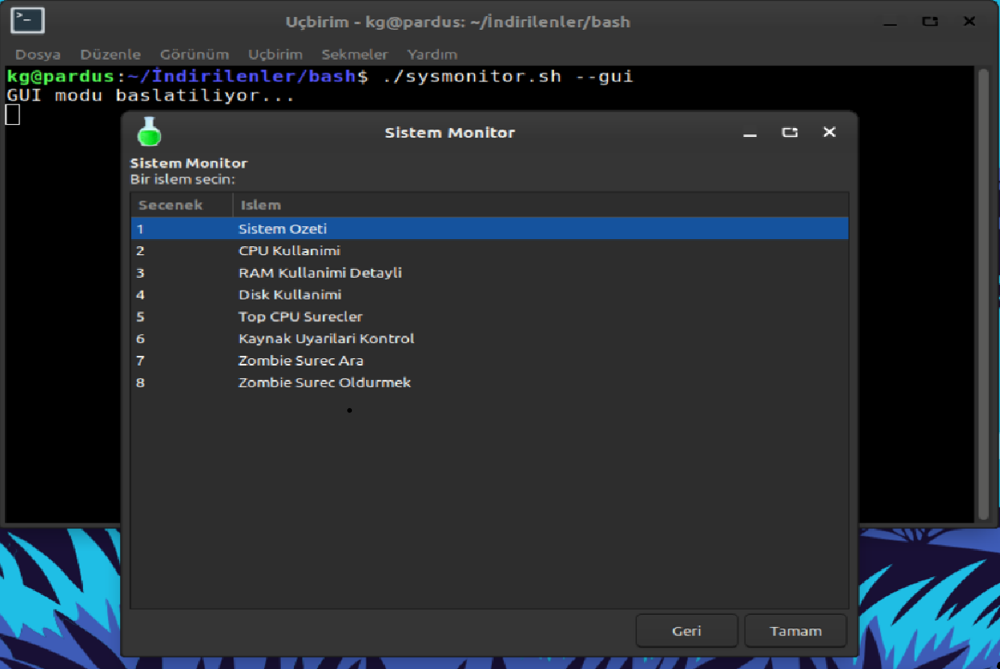

#### Sistem Monitör
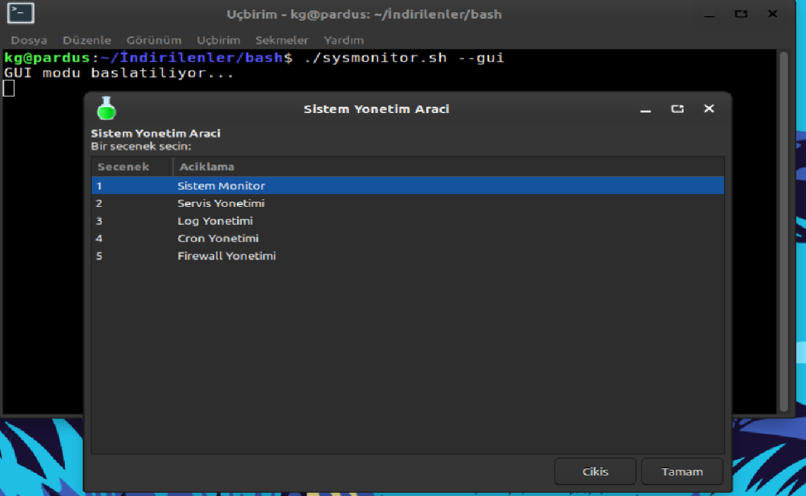

#### Servis Yönetimi
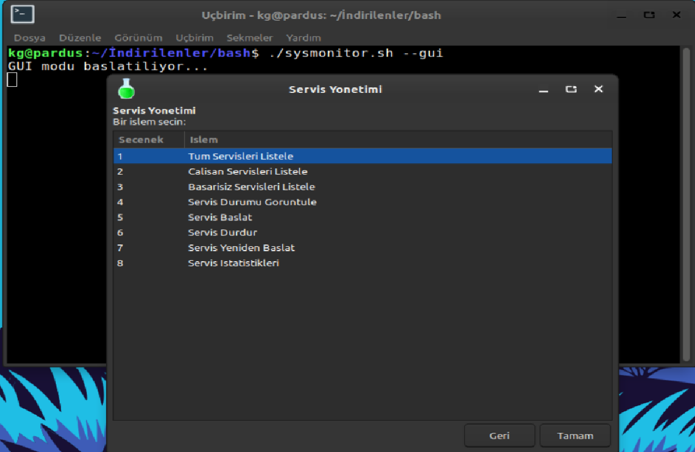

#### Log Yönetimi
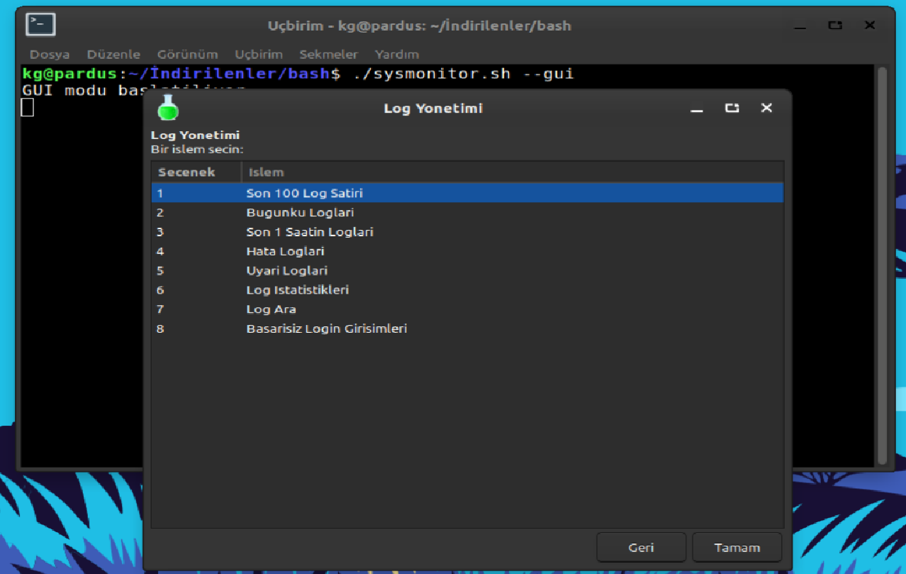

#### Cron Yönetimi
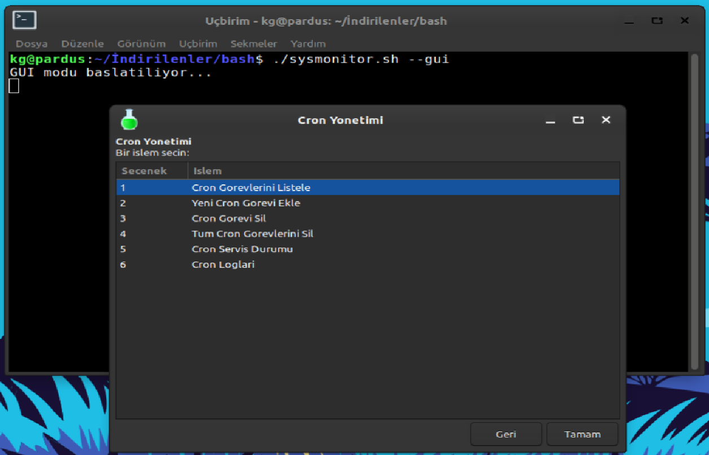

#### Firewall Yönetimi
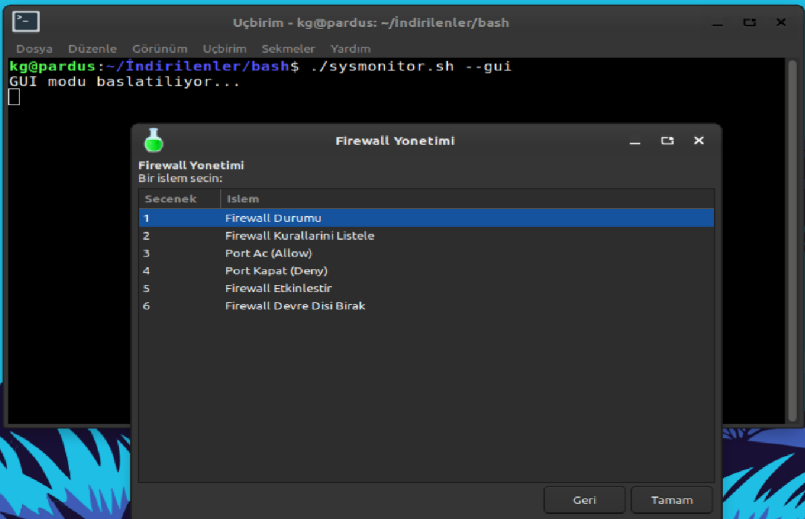

### TUI Modu

#### Ana Menü
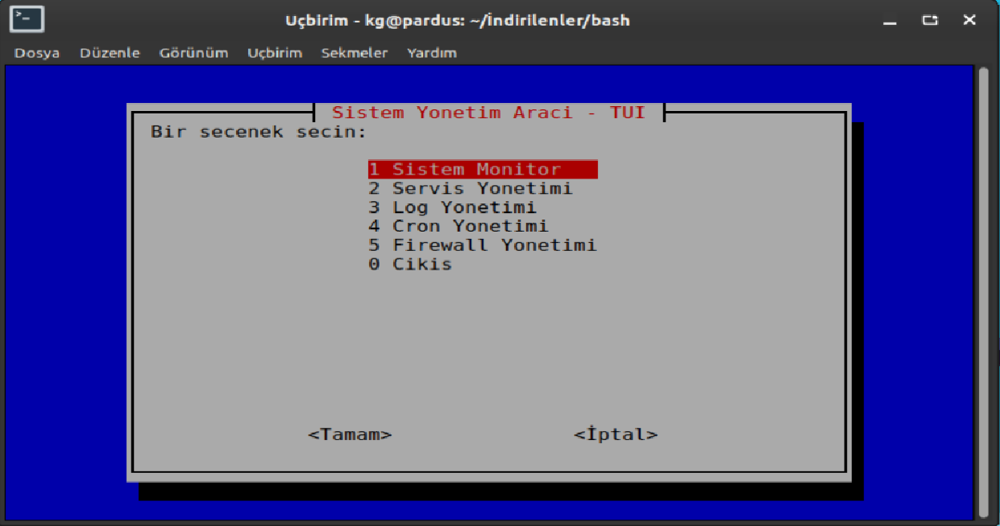

#### Sistem Monitör
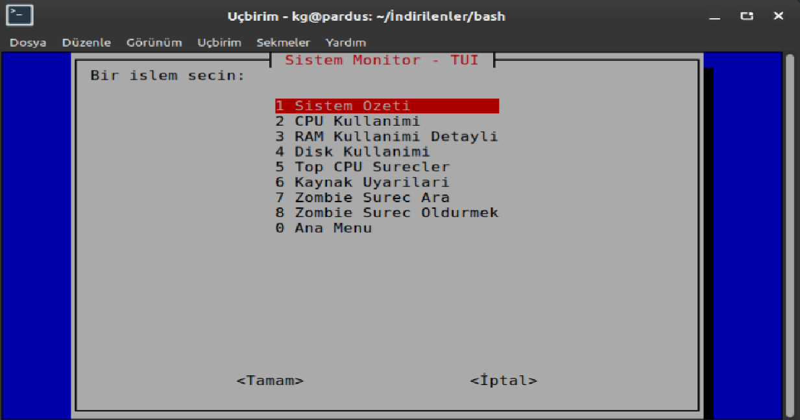

#### Servis Yönetimi
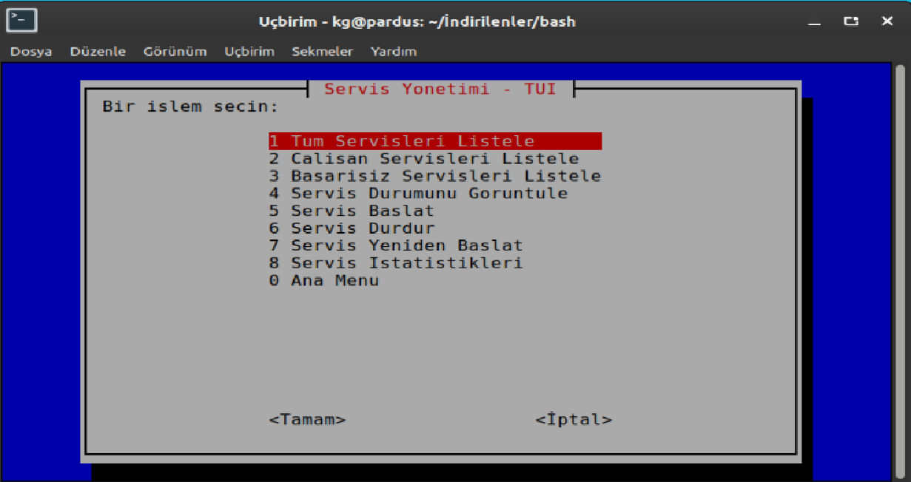

#### Log Yönetimi
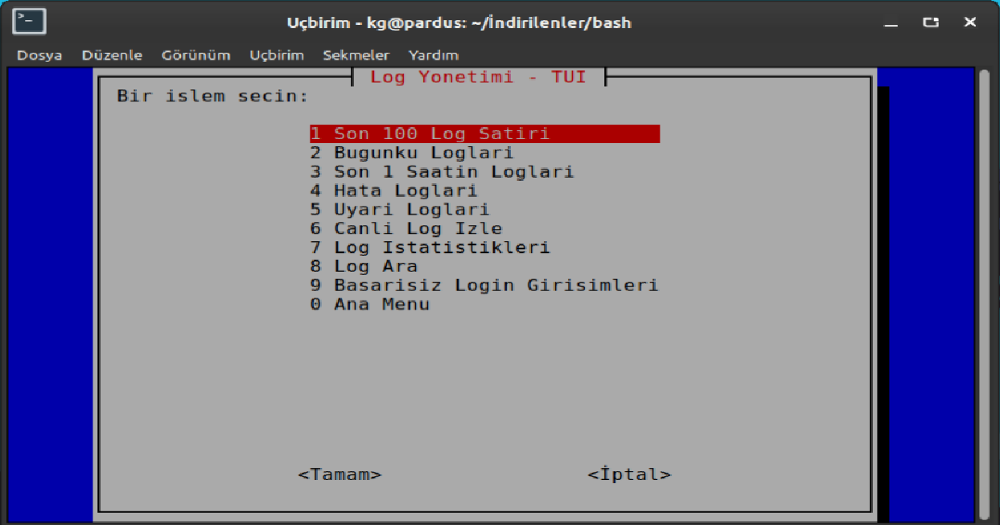

#### Cron Yönetimi
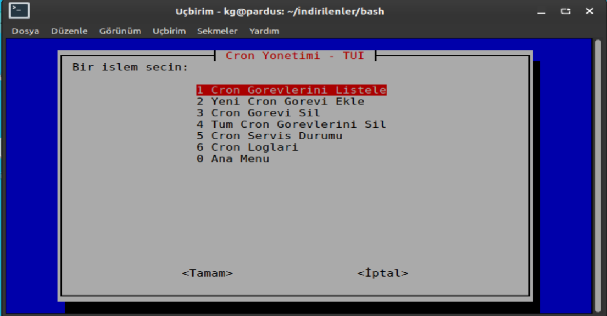

#### Firewall Yönetimi
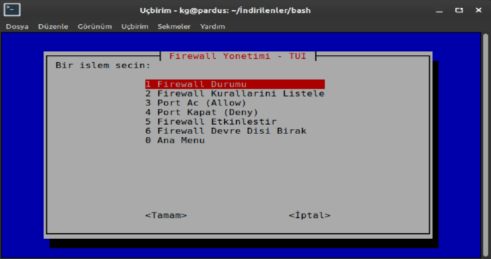


## 💡 Kullanım Örnekleri

### Örnek 1: Sistem Kaynaklarını İzleme
```bash
# GUI ile sistem izleme
./sysmonitor.sh --gui

# Ana menüden "Sistem Monitör" seçin
# CPU, RAM, Disk kullanımını görüntüleyin
```

### Örnek 2: Apache Servisini Yeniden Başlatma
```bash
# TUI ile servis yönetimi
./sysmonitor.sh --tui

# "Servis Yönetimi" > "apache2" seç > "Yeniden Başlat"
```

### Örnek 3: Firewall Port Açma
```bash
# GUI ile port açma
./sysmonitor.sh --gui

# "Firewall Yönetimi" > "Port Aç" > Port: 8080, Protokol: TCP
```

### Örnek 4: Cron Görevi Ekleme
```bash
# Günlük yedekleme görevi ekleme
# "Cron Yönetimi" > "Görev Ekle"
# Zaman: "0 2 * * *" (Her gün saat 02:00)
# Komut: "/backup/daily-backup.sh"
```

## 🔧 Yapılandırma

### Ortam Değişkenleri

```bash
# ~/.bashrc veya ~/.bash_profile dosyanıza ekleyin

# Varsayılan arayüz modu
export SYSMON_DEFAULT_MODE="gui"  # veya "tui"

# Log seviyesi
export SYSMON_LOG_LEVEL="info"    # debug, info, warning, error

# Uyarı eşikleri
export SYSMON_CPU_THRESHOLD=80    # CPU %80 üzeri uyarı
export SYSMON_RAM_THRESHOLD=85    # RAM %85 üzeri uyarı
export SYSMON_DISK_THRESHOLD=90   # Disk %90 üzeri uyarı
```


## 📄 Lisans

Bu proje MIT lisansı altında lisanslanmıştır. Detaylar için [LICENSE](LICENSE) dosyasına bakın.


## 📞 İletişim

- **GitHub Issues:** [Sorun bildir](https://github.com/korayga/go-scraper/issues)
- **Linkedin:** [korayga](https://www.linkedin.com/in/koray-garip/)

---


